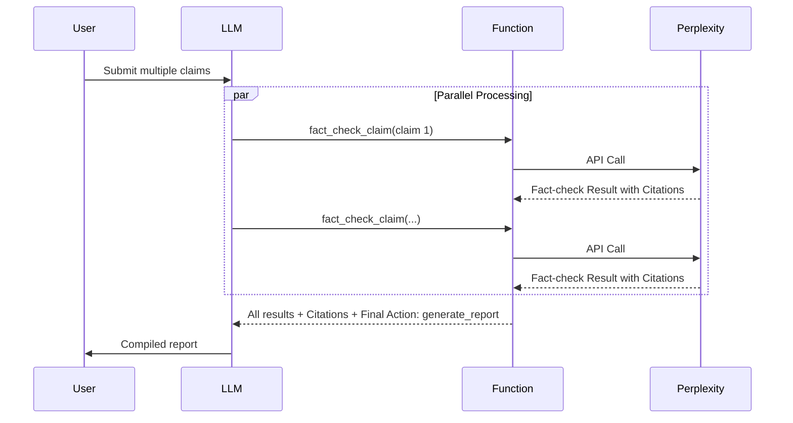
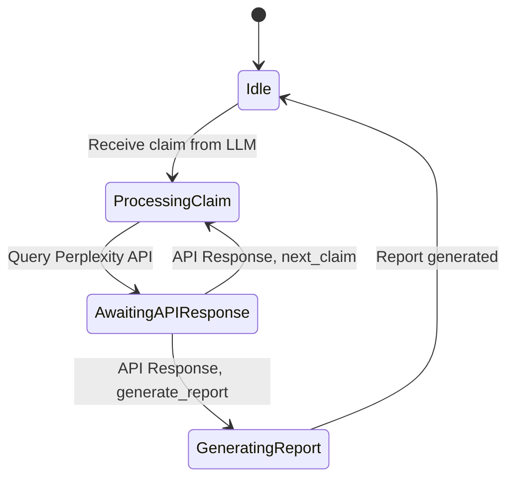

## 1. Project Overview

*   **Description:** This project aims to develop a TypingMind plugin that enables users to fact-check a list of claims. The plugin will function as a tool, callable by the LLM, that leverages the Perplexity API to verify the truthfulness of each claim. It will handle multiple claims simultaneously and return the results to the LLM for final report generation.
*   **Main Goal:** To develop a tool that automates the process of fact-checking claims by leveraging the search capabilities of the Perplexity API and the analytical abilities of an LLM.
*   **Expected End Result:** A functional TypingMind plugin that can receive claims from an LLM, query the Perplexity API, process the results, and signal the LLM to generate a comprehensive report on the validity of each claim with supporting citations.
*   **Intended User:** Hobbyist users of TypingMind interested in enhancing their ability to verify information using LLMs.
*   **Rough Scope:** Small, designed to be completed within a weekend or a few short coding sessions.

## 2. Core Features/Tasks

*   **Main Functionality:**
    *   Process multiple claims in parallel by querying the Perplexity API.
    *   Receive a claim from the LLM, along with its position in the list.
    *   Send the fact-checking results back to the LLM, including analysis and citations.
    *   Signal to the LLM alongside results from the last claim to indicate it's time to generate the final report.

*   **Must-have Features:**
    *   **Parallel Claim Processing:** Handle multiple claims simultaneously
    *   **Result Aggregation:** Combine results from parallel calls into final report
    *   **State Tracking:** Track progress of multiple concurrent fact checks
    *   **Perplexity API Integration:** Successfully query the API with a given claim and retrieve relevant results.
    *   **Result Handling:** Extract the analysis and citations from the API response.
    *   **LLM Communication:** Properly send results to the LLM and send instructions for the next action.
    *   **Report Generation Signal:** Instruct the LLM when to the final report alongside deliverance of the final fact checked claim.

*   **Nice-to-have Features:**
    *   **Error Handling and Retries:** Implement robust error handling for API call failures, with potential retry mechanisms.
    *   **User Customization:** Allow users to configure settings like the Perplexity model or system message.
    *   **Token Efficient Output:** Ensure the LLM doesn't output unnecessary or repeating content during the fact checking process.

*   **Task Breakdown:**
    *   **TypingMind Plugin Setup:** Create the basic plugin structure (`implementation.js`, `plugin.json`, `README.md`) according to the provided development guide.
    *   **Function Specification:** Define the OpenAI function spec for `fact_check_claim` in `plugin.json`.
    *   **Perplexity API Interaction:**
        *   Build the API request with the appropriate parameters (claim, model, system message).
        *   Send the request and handle the response.
        *   Extract the relevant information (analysis, citations).
    *   **LLM Communication Logic:**
        *   Receive and parse the claim and other parameters from the LLM.
        *   Format and send the results back to the LLM, including `next_action`.
    *   **Parallel Processing and State Management:**
        *   Implement logic to track the status of each claim.
        *   Manage concurrent API calls and ensure proper synchronization.
    *   **Report Generation Logic:**
        *   When signaled, format the collected results into a comprehensive report.

*   **Natural Ordering/Dependencies:**
    *   User submits claims to the LLM.
    *   LLM calls the `fact_check_claim` function and passes each claim on separate calls.
    *   The function queries the Perplexity API for each claim.
    *   The function processes the API response, determines the truth status, and sends the results back to the LLM.
    *   The LLM generates the final report when signaled.

## 3. Technical Details

*   **Programming Language:** JavaScript (due to the browser-based nature of TypingMind plugins).
*   **Key Libraries/Frameworks:**
    *   Standard JavaScript built-in `fetch` API for making HTTP requests to the Perplexity API.
    *   No other external libraries are required.
*   **Data Storage Requirements:**
    *   No persistent data storage is needed. All data will be handled in-memory during the execution of the function and in the LLM context.
*   **API Integrations:**
    *   **Perplexity API:** Used to perform internet searches and retrieve fact-checking information. The function tool will need to authenticate with the API using a user-provided API key.
    *   **OpenAI Function Calling API:** The structure and parameters of the `fact_check_claim` function will be defined according to this specification, allowing the LLM to call it correctly.
*   **Basic Architecture Decisions:**
    *   The core of the plugin will be a single function, `fact_check_claim`, which will be called by the LLM for each claim.
    *   Helper functions could be used to encapsulate specific tasks, such as:
        *   `queryPerplexity`: Handles the interaction with the Perplexity API.
        *   `determineTruthStatus`: Analyzes the Perplexity response to determine if a claim is true, partially true, or false.
        *   `formatReport`: (Potentially handled by the LLM) Formats the final report with all claims, their statuses, and citations.
    *   Flow control logic will manage the sequence of claims and determine when to signal the LLM to generate the report.
*   **Handling User Settings:**
    *   The plugin will allow users to input their Perplexity API Key through the TypingMind plugin settings interface.
    *   Optional settings, such as the Perplexity model and system message, can also be configured by the user.
*   **Security Considerations:**
    *   API keys must be handled securely within the TypingMind environment and should never be exposed in the client-side code. TypingMind's plugin architecture should provide mechanisms for secure storage of sensitive information.
    *   Due to the plugin running in the user's browser, be mindful of Cross-Origin Resource Sharing (CORS) limitations when making requests to external APIs. The Perplexity API must allow requests from the TypingMind domain.

### Parallel Processing Capabilities
- **Implementation:** Leverages TypingMind's support for parallel function calls
- **Benefits:** 
  - Process multiple claims simultaneously rather than sequentially
  - Reduces total processing time
  - Improves user experience with faster results
- **Requirements:**
  - Each function call must be independent
  - Claims need unique identifiers (`claim_number`) 
  - System needs to track total claims (`total_claims`)

## 4. Constraints and Preferences

*   **Coding Style Preferences:**
    *   Employ ES6+ syntax and features where applicable (e.g., arrow functions, `async/await`, template literals).
    *   Write clear, concise, and well-structured code.
    *   Include comments to explain complex logic or non-obvious code sections.
    *   Follow consistent naming conventions (e.g., camelCase for variables and functions).
*   **Performance Requirements:**
    *   While performance is not the primary concern for a small hobby project, aim for reasonably efficient code.
    *   Prioritize code readability and maintainability over micro-optimizations unless significant performance bottlenecks are identified.
    *   Minimize unnecessary API calls or computations.
    *   Focus on token efficiency. Minimize token usage for the user LLM. Token efficient meaning that we don't want the LLM to output repeating content until it generates the final report. Quality should not be materially diminshed to achieve this.
*   **Platform Constraints:**
    *   The plugin must function correctly within the TypingMind environment and adhere to its plugin architecture guidelines.
    *   Since the code will execute in the user's browser, be aware of and work within the limitations of a browser-based JavaScript environment, particularly regarding CORS.
*   **Personal Learning Goals:**
    *   Gain practical experience with integrating external APIs into a project.
    *   Develop a deeper understanding of the TypingMind plugin architecture.
    *   Learn how to manage state effectively in asynchronous operations, especially across multiple function calls.
*   **Time Limitations:**
    *   The project should be scoped appropriately for completion within a weekend or a few short coding sessions.
    *   Focus on the core functionality first and add nice-to-have features only if time permits.

## 5. Visualizations

### 5.1 Sequence Diagram

*   **Title:** Claim Fact-Checking Sequence
*   **Type:** Sequence Diagram
*   **Purpose:** To illustrate the interaction sequence between the User, LLM, Function Tool, and Perplexity API during the fact-checking process. This helps visualize the flow of data and the order of operations.
*   **Data:** Interactions between User, LLM, Function Tool, and Perplexity API, including sending claims, querying the API, returning results, and generating the report.
*   **Tool:** Mermaid.js
*   **Code:**



### 5.2 State Diagram

*   **Title:** Claim Processing States
*   **Type:** State Diagram
*   **Purpose:** To model the different states of the claim processing workflow. This helps visualize how the system transitions between states based on events and conditions.
*   **Data:** States such as "Idle," "Processing Claim," "Awaiting API Response," and "Generating Report," along with the transitions between them.
*   **Tool:** Mermaid.js
*   **Code:**



## 6. Code Skeletons/Boilerplate Code

*Note: The following code is preliminary and subject to change as the project progresses.*

### File Structure:

```
fact-check-plugin/
├── implementation.js
├── plugin.json
└── README.md
```

### `implementation.js`:

```javascript
function search_via_perplexity_sonar(params, userSettings) {
  const keyword = params.keyword;
  const model = userSettings.model || 'sonar';
  const systemMessage = userSettings.systemMessage || 'Be precise and concise.';
  const key = userSettings.apiKey;
 
  if (!key) {
    throw new Error(
      'Please set the Perplexity API Key in the plugin settings.'
    );
  }
 
  return fetch('https://api.perplexity.ai/chat/completions', {
    method: 'POST',
    headers: {
      'content-type': 'application/json',
      accept: 'application/json',
      authorization: 'Bearer ' + key,
    },
    body: JSON.stringify({
      model: model,
      messages: [
        {
          role: 'system',
          content: systemMessage,
        },
        {
          role: 'user',
          content: keyword,
        },
      ],
    }),
  })
    .then((r) => r.json())
    .then((response) => {
      const content = response.choices.map((c) => c.message.content).join(' ');
      const citations = response.citations;
 
      const citationsText = citations
        ? '\\n\\n Citations:\\n' + citations.map((c, index) => `[${index + 1}] ${c}`).join('\\n')
        : '';

      return (
        content +
        citationsText +
        '\\n\\nIMPORTANT: When using this information in your response, you must include the citations provided above. Place citation numbers [X] immediately after the information they support and include the complete Citations section at the end of your response.'
      );
    });
}
```
### `plugin.json`:

```json
{
  "id": "search_via_perplexity_sonar",
  "uuid": "9cc8cbd1-2add-4634-b06e-3bae18763230",
  "emoji": "🔍",
  "title": "Perplexity Sonar Search",
  "iconURL": "https://custom.typingmind.com/assets/models/perplexityai.png",
  "githubURL": "https://github.com/TaxingAuthority/Perplexity-Sonar-Search",
  "httpAction": {
    "id": "4b3dda94-9f08-46da-b6f6-28b5883ab5b5",
    "url": "https://api.perplexity.ai/chat/completions",
    "name": "",
    "method": "POST",
    "hasBody": true,
    "hasHeaders": true,
    "requestBody": "{\"model\": \"{model}\",\"messages\": [{\"role\": \"system\",\"content\": \"{systemMessage}\"},{\"role\": \"user\",\"content\": \"{keyword}\"}]}",
    "requestHeaders": "{\"accept\": \"application/json\",\"authorization\": \"Bearer {apiKey}\"}",
    "resultTransform": {
      "engine": "jmes",
      "expression": "choices[*].message.content | join(' ', @)"
    },
    "hasResultTransform": true
  },
  "openaiSpec": {
    "name": "search_via_perplexity_sonar",
    "parameters": {
      "type": "object",
      "required": [
        "keyword"
      ],
      "properties": {
        "keyword": {
          "type": "string",
          "description": "The search keyword"
        }
      }
    },
    "description": "Search for information from the internet using Perplexity."
  },
  "outputType": "respond_to_ai",
  "userSettings": [
    {
      "name": "apiKey",
      "type": "password",
      "label": "Perplexity API Key",
      "required": true,
      "description": "Get your API Key from Perplexity: https://www.perplexity.ai/settings/api"
    },
    {
      "name": "model",
      "label": "Model", 
      "description": "Optional; options: \"sonar\", \"sonar-pro\", \"sonar-reasoning\"; default: \"sonar\"",
      "defaultValue": "sonar",
      "placeholder": "sonar (default)"
    },
    {
      "name": "systemMessage",
      "label": "System Message",
      "description": "Optional, default: \"Be precise and concise\"",
      "defaultValue": "Be precise and concise"
    }
  ],
  "overviewMarkdown": "This plugin allows the AI assistant to search for information from the internet using Perplexity Sonar.\n\n**🔑 Perplexity API Key needed**. Click the Settings tab and enter your API Key. Get your Perplexity API Key from [here](https://www.perplexity.ai/settings/api)\n\nExample usage:\n\n> What's the gold price?\n\n> How's the weather at HCMC at the moment?\n",
  "authenticationType": "AUTH_TYPE_NONE",
  "implementationType": "javascript"
}
```
### `README.md`:

```markdown
# Fact Checker Plugin for TypingMind

This plugin allows users to fact-check claims by leveraging the Perplexity API. It can process multiple claims in parallel and returns the results to the LLM for report generation.

**🔑 Perplexity API Key needed**. Click the Settings tab and enter your API Key. Get your Perplexity API Key from [here](https://www.perplexity.ai/settings/api)

## Example Usage:

> Fact-check the following claims:
> 1. The Earth is flat.
> 2. Water boils at 100°C.
> 3. Humans can breathe underwater.
```

## 7. Testing Requirements

*   **Testing Focus:**
    *   Verify that each claim is correctly fact-checked and assigned the appropriate status ("true," "partially true," or "false").
    *   Ensure that citations are correctly extracted from the Perplexity API response and included in the results.
    *   Test the parallel processing of claims to ensure the correct flow and communication with the LLM.
    *   Verify that the final report is generated correctly when the `generate_report` signal is sent.
*   **Edge Cases:**
    *   Network failures or timeouts during Perplexity API calls.
    *   Unexpected or malformed responses from the Perplexity API.
    *   Invalid input parameters (e.g., missing claim, incorrect claim number).
    *   Empty or excessively long claims.
    *   Claims that are ambiguous or difficult to fact-check.
    *   API rate limiting.
    *   Concurrent requests exceeding the API's capacity.
*   **Validation Approaches:**
    *   Implement comprehensive error handling using `try-catch` blocks to catch and handle potential exceptions during API calls and data processing.
    *   Use mock data to simulate different types of Perplexity API responses during development and testing, allowing you to test various scenarios without making actual API calls.
    *   Validate the input parameters at the beginning of the `fact_check_claim` function to ensure they are of the correct type and format.
*   **Manual Testing Checkpoints:**
    *   Test the plugin with a single claim input and verify that the result is correct (status, analysis, citations).
    *   Test with multiple claims and verify that they are processed in parallel and the final report (if generated by the plugin) is accurate.
    *   Test with an invalid or missing Perplexity API key and verify that the plugin displays an appropriate error message.
    *   Manually inspect the generated report (if generated by the plugin) to ensure it is formatted correctly and includes all the necessary information (claim, status, analysis, citations).

## 8. Deployment Plan

*   **Execution Environment:** The plugin will run entirely within the user's browser as part of the TypingMind platform.
*   **Hosting Requirements:** The source code will be hosted on Github and extracted into TypingMind.
*   **Packaging/Distribution:**
    *   Package the plugin according to the TypingMind plugin development guidelines. This will likely involve creating a single JavaScript file (`implementation.js`) containing all the necessary code, along with the `plugin.json` and `README.md` files.
*   **Setup Instructions:**
    *   Users will need to obtain a Perplexity API Key from the Perplexity website ( [https://www.perplexity.ai/settings/api](https://www.perplexity.ai/settings/api) ) and input it into the plugin settings within TypingMind.
    *   Optionally, users can configure the Perplexity model and system message they want to use in the plugin settings.
*   **User Documentation:**
    *   Include a comprehensive README file or overview section within the plugin itself that explains its purpose, functionality, and usage.
    *   Provide clear, step-by-step instructions on how to install and configure the plugin.
    *   Include examples of how to input claims and interpret the generated report.
    *   Explain any limitations or known issues.

## Conclusion

This document provides a comprehensive plan for developing a fact-checking plugin for TypingMind. It outlines the project's goals, core features, technical details, constraints, visualizations, code structure, testing requirements, and deployment plan. This plan serves as a guide for both the developer and an LLM coding assistant throughout the development process. The LLM can use this document to understand the project's context, generate code snippets, suggest improvements, and help with debugging. By following this plan and collaborating with an LLM, the developer can effectively create a functional and useful TypingMind plugin that enhances the platform's fact-checking capabilities. Remember that this plan is a starting point and may be refined as the project evolves. The key is to maintain clear communication between the developer and the LLM to ensure a successful outcome.
